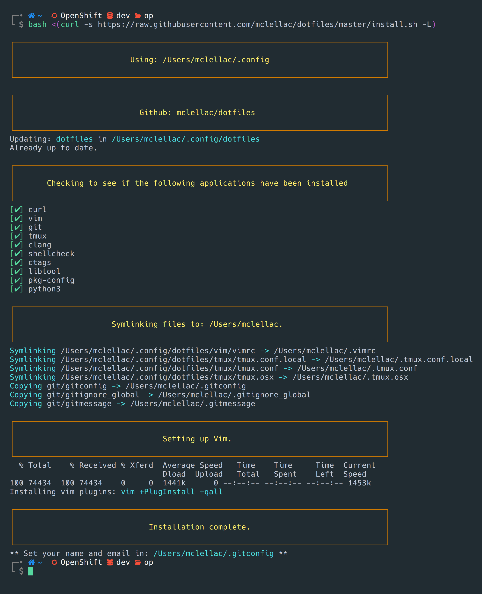

# mclellac dotfiles

My collection of dotfiles.



## Installation

This is very much tailored for my own use-case, but feel free to use as you desire.

This Python script is designed to automate the setup process for various configurations and installations on Unix-like systems. It provides a streamlined way to install packages, copy directories and files, and perform post-installation actions. Below, you'll find an overview of its functionalities and usage instructions.

### Install:
```bash
$ git clone https://github.com/mclellac/dotfiles.git ~/.config/
$ cd ~/.config/dotfiles
$ ./setup.py
```

### Requirements

  * Python 3.6 or higher
  * Unix-like operating system (Linux, macOS, etc.)


## Usage

### Command-line options

| Option               | Description                                                             |
|----------------------|-------------------------------------------------------------------------|
| -f, --force          | Override existing files if necessary.                                   |
| --config             | Specify the path to the YAML configuration file. Default is config.yaml.|
| --skip-vimplug       | Skip updating Vim plugins.                                              |
| --skip-zgen          | Skip updating Zgen.                                                     |
| --skip-shell-to-zsh  | Skip changing the shell to Zsh.                                         |
| --skip-packages      | Skip package installation.                                              |


### Configuration File

The script utilizes a YAML configuration file (`config.yaml` by default) to define tasks. You can customize the tasks according to your requirements. Refer to the provided `config.yaml` for the structure and examples.

## Functionality Overview

### Package Installation

The script detects the operating system and installs packages using appropriate package managers such as `dnf`, `pacman`, `apt`, or `brew`. It also installs Python packages using `pip`.

### File and Directory Copying

It copies directories and files specified in the configuration file to desired locations.
Post-Installation Actions

After the main installation tasks, the script performs various post-installation actions, such as updating `Vim`/`Neovim`, changing the shell to `Zsh`, and updating `Zgen`.

### Logging and Error Handling

The script provides rich logging and error handling features to ensure smooth execution and easy debugging.

### Customization

Feel free to modify the script and the configuration file to suit your specific setup requirements. You can add new tasks, change package lists, or extend post-installation actions as needed.